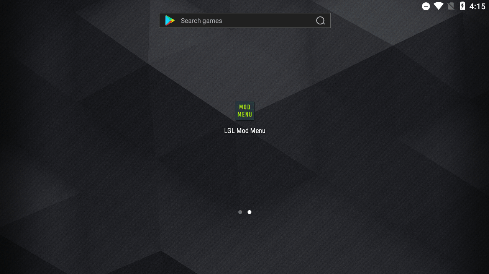

# Important
It is with great regret that I have to announce that development work on Mod Menu Template and all pther projects will be permanently stopped. The reason for this is that I'm no longer interested in Android modding scene and due to health and changes in my personal life. And, I have sold my Android phone (now own an iPhone)

I will delete my Telegram account and Github account in 1. november 2024. I will delete everything Android related from my PC forever

Please feel free to fork the project and make improvements, or find other modders who will continue to contribute to this project

The LGL Team Telegram channel will not be deleted since this channel is owned by Spring Musk https://t.me/Layout_musk

Goodbye everyone

# Introduction

Floating mod menu for il2cpp and other native android games. KittyMemory, MSHook, And64InlineHook and basic string obfuscator (AY obfuscator) included. Assets are stored as base64 in cpp and does not need to be stored under assets folder.

Support Android 4.4.x up to Android 15. ARMv7 and ARM64 are supported.

# Known bug
- Spinner does not show on some devices running Android 11. Should work again on Android 12
- On some games, menu is using old layout such as Kitkat or Gingerbread when launched without permission. We have not found a way to fix it.

# Getting started
 
See "Docs" folder

# Need help

If you have an issue with Hooking and game crashes, you should go to the **support forums**. Here there are no teachers who can help you with such issues.

# Credits
Thanks to the following individuals whose code helped me develop this mod menu

* Octowolve/Escanor - Mod menu: https://github.com/z3r0Sec/Substrate-Template-With-Mod-Menu and Hooking: https://github.com/z3r0Sec/Substrate-Hooking-Example
* VanHoevenTR - Mod menu - https://github.com/LGLTeam/VanHoevenTR_Android_Mod_Menu
* MrIkso - First mod menu template https://github.com/MrIkso/FloatingModMenu
* MJx0 A.K.A Ruit - https://github.com/MJx0/KittyMemory
* Rprop - https://github.com/Rprop/And64InlineHook
* And everyone else who provided input and contributions to this project!

# License
**GNU General Public License 3**

# Disclaimer
This project is for Educational Use only. We do not condone this project being used to gain an advantage against other people. This project was made for fun. If you are using this project for modding/hacking PU*G, C*DM, and any other Tencent games, we ask you to STOP immediately!

Do not buy any source codes on Telegram even if the author can be trusted, there is always a risk getting scammed. We will not be responsible for that. This project is always FREE to use
